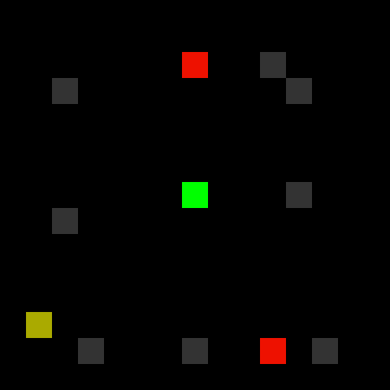

# Gravi

Small puzzle game written in C targeting Linux and the web (HTML5/WASM/JavaScript).



# Building

## Linux

### Prerequisites
* GCC
* SDL2

Build
```
$ make linux
```
Enjoy
```
$ ./gravi
```

## Web

### Prerequisites
* Emscripten
* Python 3 (for running test server)

Build
```
$ make web
```
Run the test server
```
$ ./serve.sh
```
Navigate to http://localhost:8000/gravi.html
